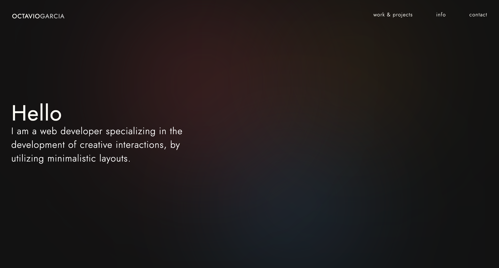

<h3 align="center">Web Dev Portfolio</h3>

  
 
    
  

## Info

   

### Built With

- [React.js](https://reactjs.org/)
- [Firebase](https://firebase.google.com/)

(<a href="#top">back to top</a>)

